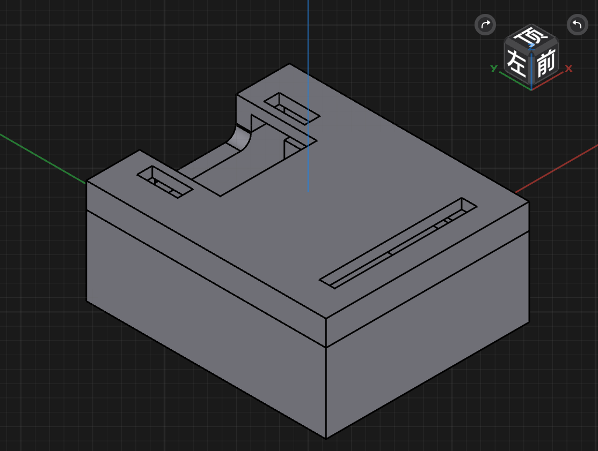

# Hardware

## 1. Motherboard

[>>>Seeed Xiao BLE Sense<<<](https://www.seeedstudio.com/Seeed-XIAO-BLE-Sense-nRF52840-p-5253.html)

### Pinout

### Schematic

[Seeed XIAO nRF52840 v1.0.pdf](./motherboard/Seeed%20XIAO%20nRF52840%20v1.0.pdf)

---

## 2. Battery

[>>>Taobao link<<<](https://item.taobao.com/item.htm?spm=a1z09.2.0.0.7b0f2e8dP6xJ2R&id=649415704595&_u=f1ga4a6r8ec8)

[Picture](./datasheet/battery.jpg)

---

## 3. Datasheet

### 3.1 IMU

[6-axis-IMU-lsm6ds3tr](./datasheet/6-axis-IMU-lsm6ds3tr-c.pdf)

### 3.2 SoC

[nrf52840-soc](./datasheet/nrf52840-soc-2.3_sc.pdf)

### 3.3 Battery Charger

[1s-charger-bq25100](./datasheet/1s-charger-bq25100.pdf)

---

## 3D Model

For 3D printer.
* [xiao_bottom](./model_3d/)
* [xiao_top](./model_3d/)

### Assembly
